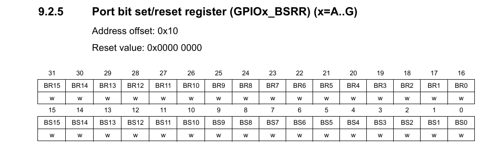
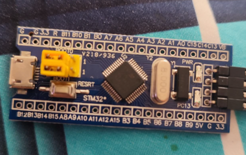
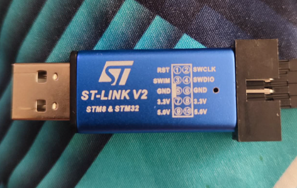
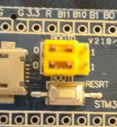

# Bare-Metal STMF103 - Blinky (Register Level)
## What This is
This is my first step into bare-metal programming, and I am using the STM32F103C8T6 (Blue Pill). 

Goal: Blink the onboard LED on PC13 using direct register access — no HAL, no CMSIS drivers, just addresses and bit manipulation.

I’m using this project to understand how the microcontroller actually works under the hood.

## Acknowledgement
Before anything, I'd like to mention and thank this guide: https://github.com/cpq/bare-metal-programming-guide 

It helped me understand the structure of bare-metal programming. In addition to that, I used the reference manual and other sources for deeper understanding.

## Required Documents
There are two documents we need, before proceeding with the code:
1. **Datasheet**
It includes:
- Electrical Characteristics
- Pinout
- Memory sizes

2. **Reference Manual (RM0008)**
It includes:
- Peripheral registers
- Registers addresses
- Bit descriptions
- Clock tree
- Memory map

*The reference manual is heavily used*

3. **Essential Files**
- C code
- Startup code
- Linker script
- Makefile

4. **Hardware**
- STM32F103C8T6 (Blue Pill)
- ST-Link V2 programmer

## Introduction
*Note that you do not need to fully understand all these to proceed. I just put all the valuable terms and details here for familiarity, and for when I encountered an unfamilar concept, I can look it up.*

The Microcontroller(MCU) is a small computer on a single chip. Unlike a desktop, CPU, a microcontroller includes:
- CPU Core
- RAM
- Flash Memory
- Peripherals (GPIO, UART, SPI, I2C, Timers, ADC, etc.)

All in one package.

- **CPU Core** executes instructions in a simple cycle:
    1. Fetch instruction from memory
    2. Decode instruction
    3. Execute instruction
    4. Repeat

This is called the fetch-decode-execute cycle

- **Registers** Registers are small, extremely fast storage locations inside the CPU. *They are not RAM*, They are inside the processor itself. There are two types:
    1. **General Purpose Registers** are used for storing temporary values, performing arithmetic, passing function arguments.
    2. **Special Registers** controls the CPU behavior.
        - **Program Counter (PC)** holds the address of the next instruction, and automatically updates after each instruction.
        - **Stack Pointer (SP)** points to the top of the stack, and used for function calls and local variables.
        - **Link Register (LR) (ARM)** stores return address during function calls.
        - **Status Register** contains flags like: zero, negative, carry, overflow

- **The Stack** is used for function calls, local variables, saving registers, and interrupt handling. The stack works as LIFO (Last In, First Out). Typical stack behavior (descending stack):
```
PUSH → SP decreases
POP  → SP increases
```
- **Memory-Mapped I/O and Peripherals**. Peripherals are hardware modules for interacting with the outside world. Microcontrollers use memory-mapped I/O. That means peripherals are controlled by writing to specific memory addresses.

- **What happens at Reset?** When the microcontroller resets:
    1. The Stack Pointer is initialized
    2. Program Counter is loaded with reset handler address
    3. Reset handler runs
    4. The main() function is called

In bare-metal, we usually write or control:
    - Startup code
    - Vector table
    - Linker script

- **Interrupts**:
    - Stops normal execution
    - Saves CPU context to stack
    - Jumps to interrupt handler
    - Returns to previous code
    Used for:
    - Timers
    - UART receive
    - GPIO events
    - ADC completion

Interrupts rely heavily on the stack pointer.

- **Volatile**. When we are accessing hardware registers, `volatile` tells the compiler that a variable may change outside the program’s control, so every read and write must actually access memory and must not be optimized away.

- **Flash Memory** is a non-volatile memory that stores our program and constant data inside the microcontroller.

- **RAM** is a temporary working memory (stack, heap, variables)

## Step 1 - Clock
A microcontroller needs a clock to run. If the clock for a peripheral is not enabled, **the registers still exist in memory, but writing to them does nothing**. So before we touch the GPIO, its clock must be enabled.

In STM32F103, peripherals are connected to different internal buses:
- AHB
- APB1
- APB2

And the GPIO is connnected to APB2. *This is fixed in hardware. We can't change which bus a peripheral belongs to.*

The base addresses, each corresponding peripherals, and bus can be found in **Memory Map** section of the Reference Manual.

## Step 2 - Enable GPIOC Clock
From the RCC section:


Since our first step is to enable the GPIOC Clock, we need to find the "APB2 peripheral clock enable register", which is `RCC_APB2ENR`. We can see from the picture that above `IOPCEN` is a number "4". That number is what we call "bit".

Now, we defined Bit 4: `IOPCEN` (I/O Port C clock enable). And from the memory map section, we defined that the base address of the RCC is `0x40021000`. From the picture, we can see that the offset of APB2ENR is `0x18`. So:

0x40021000 + 0x18 = `0x40021018`

Then, we define it in C:

`#define RCC_APB2ENR (*(volatile unsigned int*)0x40021018)`

And to enable GPIOC:

`RCC_APB2ENR |= (1 << 4);`

This sets `bit 4` and turns on the clock for Port C.

## Step 3 - Configure PC13 as Output
In STM32F1, GPIO configuration is split into:

CRL → Pins 0–7


CRH → Pins 8–15


Since **PC13** is pin 13, it is configured using **CRH**.

From the memory map, we can see that the GPIOC base address is `0x40011000`. In the GPIO registers section, we can find the Port Configuration Register, and in the CRH section, we can see that its offset is `0x04`.

So: 0x40011000 + 0x04 = `0x40011004`

And we define it in C:

`#define GPIOC_CRH (*(volatile unsigned int*)0x40011004)`

In the picture below, we can see that each pin uses 4 bits:

`CNF[1:0] MODE[1:0]`

For PC13: `Bits 23:20`


From the GPIO configuration table:

Output push-pull, 2MHz:

`MODE = 10`

`CNF = 00`

Binary: 0010

Hex: 0x2

First clear those 4 bits:

`GPIOC_CRH &= ~(0xF << 20);`

Then set the desired value:

`GPIOC_CRH |= (0x2 << 20);`

## Step 4 - Controlling the Output using BSRR

Instead of toggling ODR directly, this project uses the Bit Set/Reset Register (BSRR). BSRR is preferred because:
- It is atomic
- It does not require read-modify-write
- It avoids unintended modification of other bits



From the picture, the offset is `0x10` , and the address is 0x40011000 + 0x10 = `0x40011010`

Then we define it in C:

`#define GPIOC_BSRR (*(volatile unsigned int*)0x40011010)`

On STM32:
- Lower 16 bits → Set pin
- Upper 16 bits → Reset pin

Since the Blue Pill LED is active-low:
- Writing 0 = LED ON
- Writing 1 = LED OFF

```
// LED ON
GPIOC_BSRR = (1 << (13 + 16));

// LED OFF
GPIOC_BSRR = (1 << 13);
```

The upper 16 bits resets PC13 (drive LOW), and the lower 16 bits set PC13 (drive HIGH)

### The Delay Function

```
void delay(volatile unsigned int t)
{
    while(t--);
}
```
This is a simple "busy-wait loop". *You can look this term up for in-depth explanation.*

It is:
- Not precise
- Dependent on clock frequency
- Not suitable for production firmware

It is used here only for demonstration purposes.

## C Program (main.c):
After following all the steps, our full code for the `main.c` is complete:

```
#define RCC_APB2ENR (*(volatile unsigned int*)0x40021018)

#define GPIOC_CRH   (*(volatile unsigned int*)0x40011004)
#define GPIOC_BSRR  (*(volatile unsigned int*)0x40011010)

void delay(volatile unsigned int t)
{
    while(t--);
}

int main(void)
{
    RCC_APB2ENR |= (1 << 4);

    GPIOC_CRH &= ~(0xF << 20);
    GPIOC_CRH |=  (0x2 << 20);

    while (1)
    {
        GPIOC_BSRR = (1 << (13 + 16));  // LED ON
        delay(500000);

        GPIOC_BSRR = (1 << 13);        // LED OFF
        delay(500000);
    }
}
```

## Big Picture
Now that we have our `main.c` which contains our actual blinking code, we will proceed with the other files (linker script, startup code, and Makefile) and explain why these files are important. For the bigger picture, when the microcontroller powers up:

1. CPU reads the vector table
2. Loads the initial stack pointer
3. Jumps to Reset_Handler
4. Reset_Handler calls main()
5. main() configures GPIO and toggles PC13 forever

Our files work like this:
```
startup.s    -> defines vector table + Reset_Handler
main.c       -> actual GPIO blinking logic
stm32f103.ld -> tells linker where FLASH and RAM are
Makefile     -> builds everything into a flashable binary
```

**For this project, I did not write the `startup.s`, `stm32f103.ld`, and `Makefile` completely from scratch. I used a template as a starting point and focused first on understanding.**

## Startup Code (startup.s)

```
.syntax unified
.cpu cortex-m3
.thumb

.global _estack
.global Reset_Handler

/* Stack top (20KB SRAM for STM32F103C8) */
_estack = 0x20005000

.section .isr_vector,"a",%progbits
.word _estack
.word Reset_Handler

.section .text
Reset_Handler:
    bl main
    b .
```

### Initial Stack Pointer
`_estack = 0x20005000`

RAM starts at: `0x20000000`

RAM size is 20 KB, so: `0x20000000 + 0x5000 = 0x20005000`

This sets the initial stack pointer to the top of RAM, and the stack grows downward.

### Vector Table
```
.section .isr_vector,"a",%progbits
.word _estack
.word Reset_Handler
```

This is placed at the beginning of Flash. When the MCU resets, it automatically reads:
1. Stack pointer
2. Reset handler address

And we manually defined that here.

### Reset Handler
```
Reset_Handler:
    bl main
    b .
```

`bl main` calls `main ()`. `b .` creates an infinite loop in case `main ()` ever returns.

## Linker Script (stm32f103.ld)
The Linker Script tells the compiler where the flash starts, where the RAM starts, where to place code, and where to place variables. Example:
```
FLASH (rx)  : ORIGIN = 0x08000000, LENGTH = 128K
RAM   (rwx) : ORIGIN = 0x20000000, LENGTH = 20K
```
Then:
```
.text > FLASH
.data > RAM
.bss  > RAM
```
So the code goes to Flash, variables go to RAM. Without this file, the program wouldn't know where to live in memory.

## Makefile
This project uses `make` to:
- Compile C and assembly files
- Link them into an ELF executable
- Generate a .bin file
- Flash the microcontroller

### Toolchain:
```
CC=arm-none-eabi-gcc
OBJCOPY=arm-none-eabi-objcopy
```

`arm-none-eabi-gcc` -> ARM cross-compiler (compiles and links)
`arm-none-eabi-objcopy` -> converts ELF file into raw binary

### Compiler Flags:

`CFLAGS=-mcpu=cortex-m3 -mthumb -nostdlib -Wall`

Meaning of each flag:

| Flag              | Purpose                        |
| ----------------- | ------------------------------ |
| `-mcpu=cortex-m3` | Target Cortex-M3 CPU           |
| `-mthumb`         | Use Thumb instruction set      |
| `-nostdlib`       | Do not link standard C library |
| `-Wall`           | Enable compiler warnings       |


`all: blink.bin`

When we run `make`, it builds `blink.bin`. `all` is the default entry point.

### Linking Step
```
blink.elf: startup.s main.c
	$(CC) $(CFLAGS) -T stm32f103.ld startup.s main.c -o blink.elf
```

This single command does both compiling and linking.  
1. `startup.s` is assembled. 
2. `main.c` is compiled. 
3. Both are linked together.
4. The linker script `stm32f103.ld` is used.
5. Output file is `blink.elf`.

The -T stm32f103.ld option tells the linker to use our custom linker script. This script defines the memory layout of the STM32F103 (Flash at 0x08000000, RAM at 0x20000000) and specifies where sections like .text, .data, .bss, and the vector table should be placed. Without this script, the linker would use a default layout that does not match the microcontroller’s memory map, and the firmware would not boot properly.

### Convert ELF to Binary
```
blink.bin: blink.elf
	$(OBJCOPY) -O binary blink.elf blink.bin
```

Microcontrollr typically require a raw binary to flash. This converts `blink.elf` to `blink.bin`. When we run `make`:

 `startup.s` + `main.c` -> `blink.elf` -> `blink.bin`

# Trying it on my board 
Now that the important files are complete (`main.c`, `startup.s`, `stm32f103.ld`, and `Makefile`), we can now blink the PC13. We need our board, I will be using `STM32F103C8T6` or the `Blue Pill`, and a `ST-Link V2 Programmer`.

Blue Pill


ST-Link V2 Programmer


## Wiring
The Blue Pill contains four slots, which are labeled `3V3`, `SWIO`, `SWCLK`, and `GND`. The ST-Link has 10 slots, but we are only going to use four for this process. 

Blue Pill              ST-Link
`3V3` ---------------> `3.3V`
`SWIO` --------------> `SWDIO`
`SWCLK` -------------> `SWCLK`
`GND` ---------------> `GND`

## BOOT 0 and BOOT 1 
The Blue Pill has two jumper settings: BOOT 0 and BOOT 1. These determines what the MCU boots from:

| BOOT1 | BOOT0 | Boot Source                         |
| ----- | ----- | ----------------------------------- |
| 0     | 0     | Main Flash (normal, what we want)   |
| 0     | 1     | System Memory (built-in bootloader) |
| 1     | 0     | SRAM (rarely used)                  |

For this project, we will be using `BOOT 0 = 0`, `BOOT 1 = 0`. This ensures that the MCU boots from Flash, where our program is stored.



## Blink
Our files (`main.c`, `startup.s`, `stm32f103.ld`, and `Makefile`) are completed. We also configured our board. Now, we navigate to the folder where these files are located and we type `make` in Powershell. We should be seeing `blink.elf` and `blink.bin`, and now we are all set. We plugged in the ST-Link Programmer in our Laptop or PC, and in the Powershell, we type:

`st-flash write blink.bin 0x08000000`


In the picture, the green light is the PC13 and it should be blinking after we Flash it.

# Conclusion
That sums it up. This simple project helped me understand:
1. How to access hardware registers directly
2. How to configure GPIO and clocks
3. How the MCU boots from Flash
4. How the toolchain (Makefile, linker script, startup file) all works together

*Note: I initially used `ODR` register to toggle PC13 but i could not make it work correctly. Probably I made mistakes in the read-modify-write logic. Anyway, I searched if there is a way to fix this, and found an alternative method which is using `BSRR`. This was also a nice learning moment for me to understand the difference of this two.*