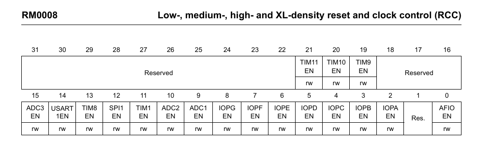
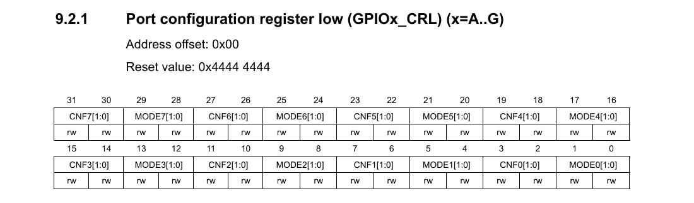
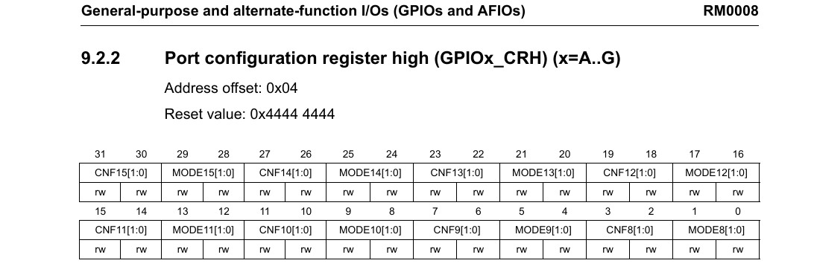
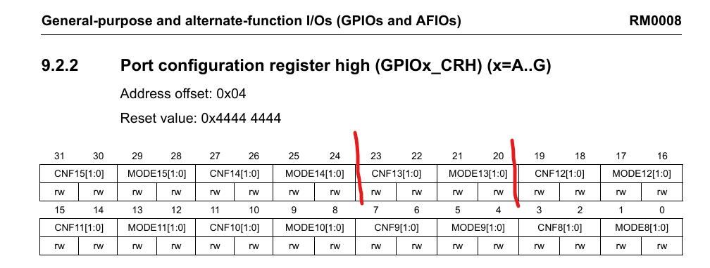

# Bare-Metal STMF103 - Blinky (Register Level)
## What This is
This is my first step into bare-metal programming, and I am using the STM32F103C8T6 (Blue Pill). 

Goal: Blink the onboard LED on PC13 using direct register access — no HAL, no CMSIS drivers, just addresses and bit manipulation.

I’m using this project to understand how the microcontroller actually works under the hood.

## Acknowledgement
Before anything, I'd like to mention and thank this guide: https://github.com/cpq/bare-metal-programming-guide 

It helped me understand the structure of bare-metal programming. In addition to that, I used the reference manual and other sources for deeper understanding.

## Required Documents
There are two documents we need, before proceeding with the code:
1. **Datasheet**
It includes:
- Electrical Characteristics
- Pinout
- Memory sizes

2. **Reference Manual (RM0008)**
It includes:
- Peripheral registers
- Registers addresses
- Bit descriptions
- Clock tree
- Memory map

*The reference manual is heavily used*

## Step 1 - Clock
A microcontroller needs a clock to run. If the clock for a peripheral is not enabled, **the registers still exist in memory, but writing to them does nothing**. So before we touch the GPIO, its clock must be enabled.

In STM32F103, peripherals are connected to different internal buses:
- AHB
- APB1
- APB2

And the GPIO is connnected to APB2. *This is fixed in hardware. We can't change which bus a peripheral belongs to.*

To confirm this: 
Reference Manual -> RCC Chapter -> Clock Tree Diagram

## Step 2 - Enable GPIOC Clock
From the RCC section:

Register: **RCC_APB2ENR**
Bit 4: **IOPCEN** (I/O Port C clock enable)

Base address of RCC:
**0x40021000**

Offset of APB2ENR:
**0x18**

So:
0x40021000 + 0x18 = **0x40021018**

Define in C:
#define RCC_APB2ENR (*(volatile unsigned int*)0x40021018)

Enable GPIOC:
RCC_APB2ENR |= (1 << 4);

This sets bit 4 and turns on the clock for Port C.

## Step 3 - Configure PC13 as Output
In STM32F1, GPIO configuration is split into:

CRL → Pins 0–7

CRH → Pins 8–15

**PC13** is in **CRH**.

GPIOC base address:
**0x40011000**

CRH offset:
**0x04**

So:
0x40011000 + 0x04 = **0x40011004**

and we define it in C:
#define GPIOC_CRH (*(volatile unsigned int*)0x40011004)

Each pin uses 4 bits:
MODE[1:0]
CNF[1:0]

For PC13:
Bits 23:20

From the GPIO configuration table:

Output push-pull, 2MHz:
MODE = 10
CNF = 00

Binary: 0010
Hex: 0x2

First clear those 4 bits:
GPIOC_CRH &= ~(0xF << 20);

Then set the desired value:
GPIOC_CRH |= (0x2 << 20);

## Step 4
ODR (Output Data Register) offset:
**0x0C**

0x40011000 + 0x0C = **0x4001100C**

Define in C:
#define GPIOC_ODR (*(volatile unsigned int*)0x4001100C)

Toggle bit 13:
GPIOC_ODR ^= (1 << 13);

### Full Code:

#define RCC_APB2ENR (*(volatile unsigned int*)0x40021018)

#define GPIOC_CRH   (*(volatile unsigned int*)0x40011004)
#define GPIOC_ODR   (*(volatile unsigned int*)0x4001100C)

int main(void)
{
    // Enable GPIOC clock
    RCC_APB2ENR |= (1 << 4);

    // Configure PC13 as output push-pull 2MHz
    GPIOC_CRH &= ~(0xF << 20);
    GPIOC_CRH |=  (0x2 << 20);

    while (1)
    {
        GPIOC_ODR ^= (1 << 13);

        for (volatile int i = 0; i < 500000; i++);
    }
}

## Understanding the Code (These notes are partially based on external explanations. I’m still reviewing and rewriting them in my own words as I go.)
### What this line really means:
#define RCC_APB2ENR (*(volatile unsigned int*)0x40021018)

1. **0x40021018** is the address we calculated above.
2. **(volatile unsigned int*)** means that the address next to it will be treated as a pointer to a 32-bit unsigned register.
- **unsigned int** -> 32-bit register
- "*" -> pointer
- **(volatile ...)** -> it tells the compiler that it should not be optimized since the value may change outside the program. *Without the **volatile**, the compiler might remove hardware access.
3. "*(...)" -> the "*" dereferences the pointer. So now, the **RCC_APB2ENR** acts like a real variable, *but it isn't a variable*. It is directly connected to the hardware.

### Enabling GPIO Clock
RCC_APB2ENR |= (1 << 4);

1. **(1 << 4)** means:
take binary **0001** and shift left by 4 bits. The result should be: **0001 0000**. *That is bit 4*, Bit 4 = IOPCEN, which means: **Enable Port C clock**
2. "|=" means: 
read register -> OR with mask -> write back
So it keeps other bit unchanged and only sets bit 4. *If we used "=", we would erase other clock enables.*

### Configuring PC13
GPIOC_CRH &= ~(0xF << 20);

This clears bits 23:20. Why? 

Each pin uses 4 bits. PC13 uses bits 23:20.

0xF
Hex F = binary 1111

Shift left 20:
1111 << 20
*Moves it into position of PC13.*

The "~" inverts it, so the **1111** becomes **0000**, now we "AND" it:
GPIOC_CRH &= ...
*This clears only 4 bits*

Now set the new value:
GPIOC_CRH |= (0x2 << 20);
0x2 = 0010

Which means:
MODE = 10 (Output 2MHz)
CNF = 00 (Push-pull)

Shift to bits 23:20 and OR it in.

Now PC13 is configured as output.

### Toggling the LED
GPIOC_ODR ^= (1 << 13);

This is XOR.

XOR flips a bit.

If bit was 0 → becomes 1
If bit was 1 → becomes 0

So LED keeps toggling.

### The Delay
for (volatile int i = 0; i < 500000; i++);

*This is just a crude delay.*

Not accurate.
Depends on clock speed.
Not recommended for real firmware.

But good for learning.

# Trying it on my board (This part is also still incomplete. Once I completely understand the code, I will be proceeding with the actual)
